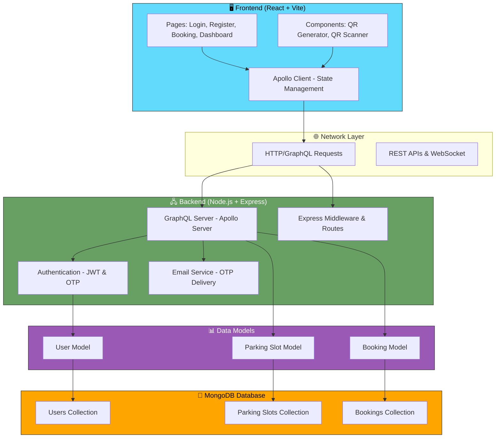
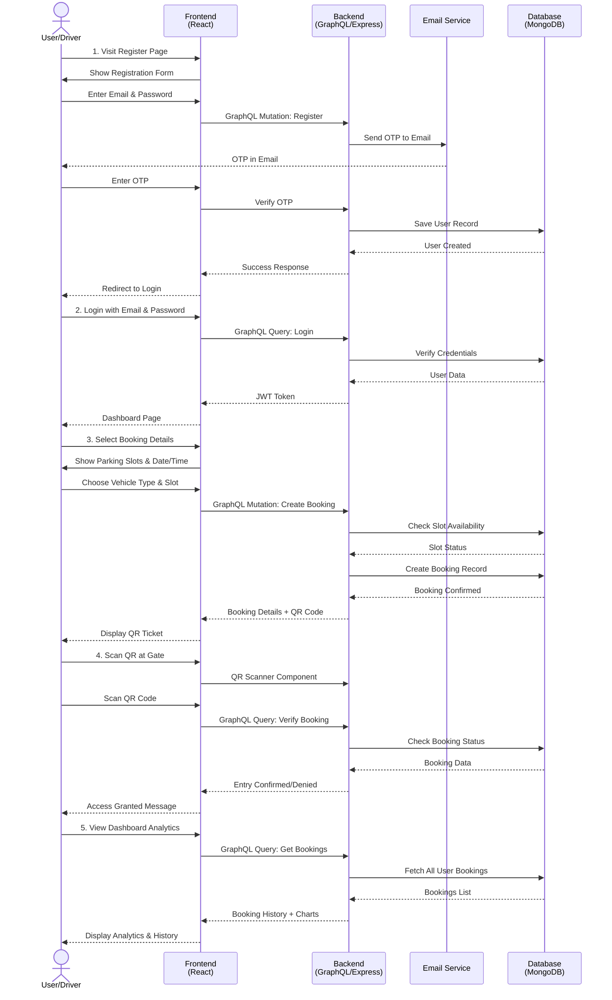

# ParkSmart - MERN Parking Management System

## Features
- User registration with OTP verification and email-based login.
- Parking slot booking for car or bike with date and time selection.
- Real-time display of available and reserved slots.
- Automatic QR code generation for confirmed bookings.
- QR code scanning with a phone camera to verify booking details.
- Booking dashboard with analytics and slot usage tracking.
- Help page with step-by-step instructions for users.

## Technology Used
- Frontend: React 19, Vite, React Router DOM.
- Backend: Node.js, Express, Apollo Server, GraphQL.
- Database: MongoDB with Mongoose.
- Authentication: JWT and OTP-based user verification.
- UI and utilities: `qrcode.react`, `html5-qrcode`, `react-toastify`, `recharts`.

## System Design & Architecture



## User Workflow & Process Flow



## Data Flow Diagram

```mermaid
graph LR
    subgraph Step1["🔐 Authentication"]
        S1A["User Registration"] --> S1B["OTP Verification"]
        S1B --> S1C["Email Confirmation"]
    end

    subgraph Step2["🅿️ Booking Process"]
        S2A["View Available Slots"] --> S2B["Select Slot & Time"]
        S2B --> S2C["Create Booking"]
        S2C --> S2D["Generate QR Code"]
    end

    subgraph Step3["🔍 Verification"]
        S3A["Scan QR Code"] --> S3B["Verify Booking"]
        S3B --> S3C["Grant Access"]
    end

    subgraph Step4["📊 Dashboard"]
        S4A["View Bookings"] --> S4B["Analytics"]
        S4B --> S4C["Booking History"]
    end

    S1C --> S2A
    S2D --> S3A
    S3C --> S4A

    style Step1 fill:#e1f5ff,stroke:#01579b,color:#000
    style Step2 fill:#f3e5f5,stroke:#4a148c,color:#000
    style Step3 fill:#e8f5e9,stroke:#1b5e20,color:#000
    style Step4 fill:#fff3e0,stroke:#e65100,color:#000
```



## Real World Problem Solved
ParkSmart solves everyday parking challenges by:
- Reducing manual ticketing, paper slips, and gate delays.
- Preventing double booking of the same parking space.
- Enabling contactless entry and exit using QR code verification.
- Allowing drivers to reserve parking before arrival.
- Providing a digital record of active and past parking bookings.

## Folder Structure
### Backend
- `backend/`
  - `package.json`
  - `src/`
    - `app.js` - Express application setup.
    - `server.js` - Apollo Server startup and GraphQL middleware.
    - `config/`
      - `db.js` - MongoDB connection helper.
      - `mail.js` - Email configuration for OTP delivery.
    - `graphql/`
      - `typeDefs.js` - GraphQL schema definitions.
      - `resolvers.js` - GraphQL query and mutation logic.
    - `middleware/`
      - `authMiddleware.js` - Authentication checks for requests.
    - `models/`
      - `Booking.js` - Booking data model.
      - `ParkingSlot.js` - Parking slot model.
      - `User.js` - User model.
    - `seed/`
      - `seedData.js` - Initial data seeding.
    - `utils/`
      - `generateOTP.js` - OTP code generator.
      - `sendOTP.js` - OTP email sender.

### Frontend
- `frontend/`
  - `package.json`
  - `vite.config.js`
  - `src/`
    - `App.jsx` - Main application component.
    - `main.jsx` - Frontend entry point.
    - `apolloClient.js` - Apollo Client configuration.
    - `App.css` / `index.css` - Global styles.
    - `assets/` - Static assets and icons.
    - `components/`
      - `QRCodeGenerator.jsx` - QR code generation component.
    - `graphql/`
      - `queries.js` - GraphQL queries for frontend.
    - `pages/`
      - `Booking.jsx`
      - `Dashboard.jsx`
      - `Help.jsx`
      - `Login.jsx`
      - `MyBookingId.jsx`
      - `Register.jsx`
      - `ScanBooking.jsx`
      - `VerifyOTP.jsx`
    - `styles/`
      - `auth.css`
      - `booking.css`
      - `dashboard.css`

## What This Project Does
ParkSmart provides a complete parking management workflow:
- Users register and verify their identity with an OTP.
- Drivers choose a vehicle type and select a parking slot.
- The backend saves booking details and prevents slot conflicts.
- A QR ticket is generated for each confirmed reservation.
- Users scan the QR code at the parking gate to confirm entry or exit.
- The dashboard shows the booking history, active reservations, and slot analytics.

## Analysis
This system is built for operators and users who need a fast, secure, and contactless parking solution.
- For operators: it simplifies slot assignment, reduces manual checks, and helps monitor occupancy.
- For users: it eliminates waiting in line, reduces booking errors, and makes parking predictable.
- For administrators: it collects booking data that can be used to improve parking efficiency.

## How to Run
1. Clone the repository.
2. Install backend dependencies:
   ```bash
   cd backend
   npm install
   ```
3. Install frontend dependencies:
   ```bash
   cd ../frontend
   npm install
   ```
4. Create a `.env` file in `backend/` with the required environment variables.
5. Start the backend server:
   ```bash
   cd ../backend
   npm run dev
   ```
6. Start the frontend app:
   ```bash
   cd ../frontend
   npm run dev
   ```

> Note: Replace the image path or add a screenshot file if you want a real project preview in the GitHub README.
